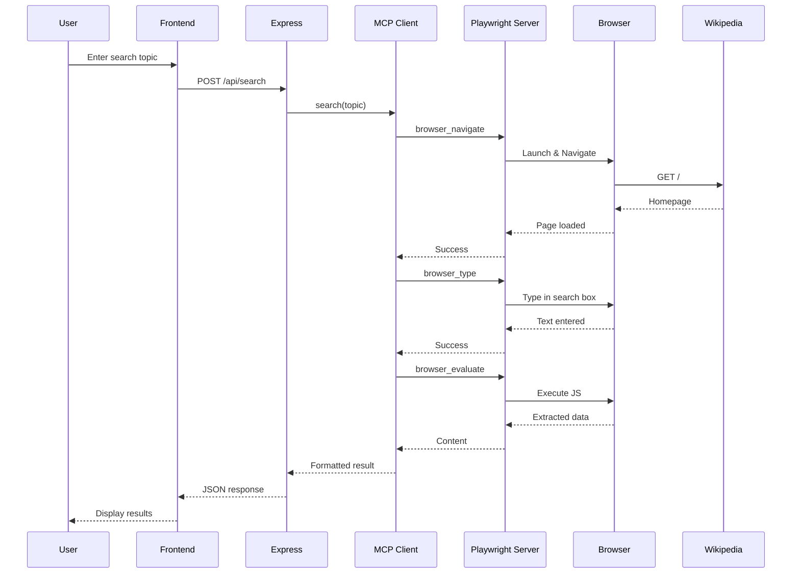

# MCP Integration Guide - Wikipedia Search Demo

## What is MCP?

The Model Context Protocol (MCP) is an open protocol that standardizes how applications provide context to LLMs. It enables:

- **Standardized Communication**: Consistent way to expose tools and resources
- **Server-Client Architecture**: Modular, extensible design
- **Multiple Transports**: Stdio (local) and SSE (remote) support
- **Tool Discovery**: Dynamic capability detection

## Playwright MCP Server

Your installed Playwright MCP server provides browser automation capabilities through MCP tools.

### Available Tools

Based on your connected server, you have access to:

1. **browser_navigate** - Navigate to URLs
2. **browser_click** - Click elements
3. **browser_type** - Type text into inputs
4. **browser_snapshot** - Capture accessibility tree
5. **browser_evaluate** - Execute JavaScript
6. **browser_take_screenshot** - Capture screenshots
7. **browser_console_messages** - Get console logs
8. **browser_close** - Close browser session

## Implementation Architecture

### Backend MCP Client

```javascript
// mcpClient.js - MCP Client Wrapper
import { Client } from '@modelcontextprotocol/sdk/client/index.js';
import { StdioClientTransport } from '@modelcontextprotocol/sdk/client/stdio.js';

class MCPPlaywrightClient {
  constructor() {
    this.client = null;
    this.transport = null;
  }

  async connect() {
    // Connect to Playwright MCP server via stdio
    this.transport = new StdioClientTransport({
      command: 'npx',
      args: ['-y', '@playwright/mcp@latest', '--browser=chromium', '--headless']
    });

    this.client = new Client({
      name: 'wikipedia-search-client',
      version: '1.0.0'
    }, {
      capabilities: {}
    });

    await this.client.connect(this.transport);
  }

  async callTool(toolName, args) {
    const result = await this.client.callTool({
      name: toolName,
      arguments: args
    });
    return result;
  }

  async disconnect() {
    await this.client.close();
  }
}
```

### Wikipedia Search Service

```javascript
// wikipediaService.js - Wikipedia Search Logic
class WikipediaSearchService {
  constructor(mcpClient) {
    this.mcp = mcpClient;
  }

  async search(topic) {
    try {
      // Step 1: Navigate to Wikipedia
      await this.mcp.callTool('browser_navigate', {
        url: 'https://en.wikipedia.org'
      });

      // Step 2: Get page snapshot to find search input
      const snapshot = await this.mcp.callTool('browser_snapshot', {});
      
      // Step 3: Type search query
      await this.mcp.callTool('browser_type', {
        target: '[name="search"]',
        text: topic,
        submit: true
      });

      // Step 4: Wait for results page
      await this.mcp.callTool('browser_wait_for', {
        time: 2
      });

      // Step 5: Extract article content
      const content = await this.mcp.callTool('browser_evaluate', {
        function: `() => {
          const title = document.querySelector('#firstHeading')?.textContent || '';
          const summary = document.querySelector('.mw-parser-output > p:not(.mw-empty-elt)')?.textContent || '';
          
          const sections = Array.from(document.querySelectorAll('.mw-heading2, .mw-heading3'))
            .slice(0, 5)
            .map(h => ({
              level: h.tagName.toLowerCase(),
              text: h.textContent.trim()
            }));

          const infobox = {};
          document.querySelectorAll('.infobox tr').forEach(row => {
            const th = row.querySelector('th');
            const td = row.querySelector('td');
            if (th && td) {
              infobox[th.textContent.trim()] = td.textContent.trim();
            }
          });

          return {
            title,
            summary: summary.substring(0, 500),
            sections,
            infobox,
            url: window.location.href
          };
        }`
      });

      return {
        success: true,
        data: JSON.parse(content.content[0].text)
      };

    } catch (error) {
      return {
        success: false,
        error: error.message
      };
    }
  }
}
```

### Express API Endpoint

```javascript
// server.js - Express Server
import express from 'express';
import cors from 'cors';
import { MCPPlaywrightClient } from './mcpClient.js';
import { WikipediaSearchService } from './wikipediaService.js';

const app = express();
const PORT = 3000;

app.use(cors());
app.use(express.json());
app.use(express.static('frontend'));

let mcpClient = null;
let wikiService = null;

// Initialize MCP connection
async function initializeMCP() {
  mcpClient = new MCPPlaywrightClient();
  await mcpClient.connect();
  wikiService = new WikipediaSearchService(mcpClient);
  console.log('MCP Playwright client connected');
}

// Search endpoint
app.post('/api/search', async (req, res) => {
  const { topic } = req.body;

  if (!topic) {
    return res.status(400).json({
      success: false,
      error: 'Topic is required'
    });
  }

  try {
    const result = await wikiService.search(topic);
    res.json(result);
  } catch (error) {
    res.status(500).json({
      success: false,
      error: error.message
    });
  }
});

// Health check
app.get('/api/health', (req, res) => {
  res.json({ status: 'ok', mcp: mcpClient ? 'connected' : 'disconnected' });
});

// Start server
initializeMCP().then(() => {
  app.listen(PORT, () => {
    console.log(`Server running on http://localhost:${PORT}`);
  });
});

// Cleanup on exit
process.on('SIGINT', async () => {
  if (mcpClient) {
    await mcpClient.disconnect();
  }
  process.exit(0);
});
```

## Frontend Integration

```javascript
// app.js - Frontend Client
class WikipediaSearchApp {
  constructor() {
    this.searchForm = document.getElementById('searchForm');
    this.searchInput = document.getElementById('searchInput');
    this.resultsDiv = document.getElementById('results');
    this.loadingDiv = document.getElementById('loading');
    
    this.setupEventListeners();
  }

  setupEventListeners() {
    this.searchForm.addEventListener('submit', (e) => {
      e.preventDefault();
      this.performSearch();
    });
  }

  async performSearch() {
    const topic = this.searchInput.value.trim();
    if (!topic) return;

    this.showLoading();

    try {
      const response = await fetch('http://localhost:3000/api/search', {
        method: 'POST',
        headers: {
          'Content-Type': 'application/json'
        },
        body: JSON.stringify({ topic })
      });

      const result = await response.json();

      if (result.success) {
        this.displayResults(result.data);
      } else {
        this.displayError(result.error);
      }
    } catch (error) {
      this.displayError('Failed to connect to server');
    } finally {
      this.hideLoading();
    }
  }

  displayResults(data) {
    this.resultsDiv.innerHTML = `
      <div class="article">
        <h1>${data.title}</h1>
        <p class="summary">${data.summary}</p>
        <h2>Table of Contents</h2>
        <ul>
          ${data.sections.map(s => `<li>${s.text}</li>`).join('')}
        </ul>
        <a href="${data.url}" target="_blank">View on Wikipedia</a>
      </div>
    `;
  }

  showLoading() {
    this.loadingDiv.style.display = 'block';
    this.resultsDiv.innerHTML = '';
  }

  hideLoading() {
    this.loadingDiv.style.display = 'none';
  }

  displayError(message) {
    this.resultsDiv.innerHTML = `
      <div class="error">
        <p>Error: ${message}</p>
      </div>
    `;
  }
}

// Initialize app
document.addEventListener('DOMContentLoaded', () => {
  new WikipediaSearchApp();
});
```

## MCP Communication Flow



## Key Benefits of MCP Integration

1. **Abstraction**: Browser automation logic separated from business logic
2. **Reusability**: Same MCP server can be used by multiple applications
3. **Standardization**: Consistent tool interface across different servers
4. **Extensibility**: Easy to add more MCP servers (database, filesystem, etc.)
5. **Maintainability**: Updates to Playwright don't require app changes

## Testing the Integration

```bash
# 1. Install dependencies
npm install

# 2. Start the server
npm start

# 3. Open browser
open http://localhost:3000

# 4. Test searches
- "Artificial Intelligence"
- "Model Context Protocol"
- "Web Scraping"
```

## Troubleshooting

### MCP Connection Issues
- Verify Playwright MCP server is installed: `npx @playwright/mcp@latest --version`
- Check server logs for connection errors
- Ensure no port conflicts

### Browser Automation Failures
- Increase timeout values for slow connections
- Check Wikipedia's structure hasn't changed
- Verify selectors are correct

### Data Extraction Problems
- Use `browser_snapshot` to inspect page structure
- Test JavaScript extraction in browser console first
- Handle missing elements gracefully

## Next Steps

1. Add more MCP servers (filesystem for caching, database for history)
2. Implement advanced features (image extraction, related articles)
3. Create additional demos showcasing other MCP capabilities
4. Build a dashboard to manage multiple MCP servers