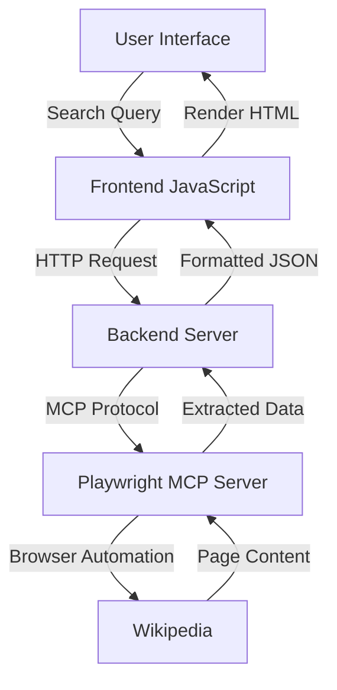

# Wikipedia Search MCP Demo - Project Plan

## Overview
Build a web application that demonstrates MCP (Model Context Protocol) integration using the Playwright MCP server to search Wikipedia, extract content, and display formatted results.

## Architecture



## Technology Stack

### Frontend
- **HTML5**: Structure and semantic markup
- **CSS3**: Styling with modern layout techniques
- **Vanilla JavaScript**: Client-side logic and API communication

### Backend
- **Node.js**: Runtime environment
- **Express.js**: Web server framework
- **MCP SDK**: Client library for MCP protocol
- **Playwright MCP Server**: Browser automation via MCP

## Application Flow

1. **User Input**: User enters a search topic in the web interface
2. **Frontend Request**: JavaScript sends search query to backend API
3. **MCP Integration**: Backend uses MCP client to communicate with Playwright server
4. **Browser Automation**: Playwright navigates to Wikipedia and searches
5. **Content Extraction**: Extract article title, summary, and key sections
6. **Data Formatting**: Structure data into clean JSON format
7. **Response**: Send formatted data back to frontend
8. **Display**: Render results in user-friendly format

## Key Features

### Core Functionality
- Search input with real-time validation
- Loading states during search operations
- Formatted display of Wikipedia content
- Error handling for failed searches

### MCP Playwright Operations
- `browser_navigate`: Navigate to Wikipedia
- `browser_type`: Enter search query
- `browser_click`: Click search button
- `browser_snapshot`: Capture page accessibility tree
- `browser_evaluate`: Extract article content
- `browser_take_screenshot`: Optional visual verification

### Data Extraction
- Article title
- Introduction/summary paragraph
- Table of contents sections
- Key facts and information
- Images (optional)
- References count

## File Structure

```
MCPDemo/
├── frontend/
│   ├── index.html          # Main HTML page
│   ├── styles.css          # Styling
│   └── app.js              # Frontend logic
├── backend/
│   ├── server.js           # Express server
│   ├── mcpClient.js        # MCP client wrapper
│   └── wikipediaService.js # Wikipedia search logic
├── package.json            # Dependencies
├── README.md               # Usage instructions
└── PLAN.md                 # This file
```

## Implementation Steps

### Phase 1: Frontend Development
1. Create HTML structure with search form and results container
2. Style the interface with Wikipedia-inspired design
3. Implement JavaScript for form handling and API calls
4. Add loading indicators and error messages

### Phase 2: Backend Setup
1. Initialize Node.js project with Express
2. Set up MCP client connection to Playwright server
3. Create API endpoint for search requests
4. Implement CORS and error handling middleware

### Phase 3: MCP Integration
1. Connect to Playwright MCP server
2. Implement Wikipedia navigation logic
3. Create content extraction functions
4. Format extracted data for frontend consumption

### Phase 4: Testing & Refinement
1. Test various search queries
2. Handle edge cases (no results, disambiguation pages)
3. Optimize performance and response times
4. Add comprehensive error handling

### Phase 5: Documentation
1. Write README with setup instructions
2. Document MCP server configuration
3. Add code comments and examples
4. Create demo video or screenshots

## MCP Playwright Tools Usage

### Navigation Flow
```javascript
// 1. Navigate to Wikipedia
use_mcp_tool: browser_navigate
  url: "https://en.wikipedia.org"

// 2. Type search query
use_mcp_tool: browser_type
  target: "search input selector"
  text: "user's search topic"

// 3. Submit search
use_mcp_tool: browser_click
  target: "search button selector"

// 4. Extract content
use_mcp_tool: browser_evaluate
  function: "() => { /* extract article data */ }"
```

## Expected Output Format

```json
{
  "success": true,
  "data": {
    "title": "Article Title",
    "url": "https://en.wikipedia.org/wiki/...",
    "summary": "First paragraph of the article...",
    "sections": [
      {
        "heading": "Section Name",
        "content": "Section content..."
      }
    ],
    "lastModified": "2026-05-15",
    "categories": ["Category1", "Category2"]
  }
}
```

## Error Handling

- **No Results Found**: Display friendly message with suggestions
- **Network Errors**: Retry logic with timeout
- **MCP Connection Issues**: Clear error messages
- **Invalid Input**: Client-side validation
- **Browser Timeout**: Configurable timeout settings

## Performance Considerations

- Cache recent searches (optional)
- Implement request debouncing
- Set reasonable timeouts for browser operations
- Limit content extraction to essential data
- Compress API responses

## Security Considerations

- Sanitize user input to prevent injection
- Validate search queries
- Rate limiting on API endpoints
- CORS configuration for allowed origins
- No sensitive data exposure

## Future Enhancements

- Multiple language support
- Image extraction and display
- Related articles suggestions
- Search history
- Export results (PDF, Markdown)
- Dark mode toggle
- Mobile responsive design
- Voice search integration

## Success Criteria

✅ User can search for any Wikipedia topic
✅ Results display within 5 seconds
✅ Clean, readable formatting of content
✅ Proper error handling for all edge cases
✅ Clear demonstration of MCP integration
✅ Well-documented code and setup process

## Demo Talking Points

1. **MCP Protocol**: Explain how MCP enables tool communication
2. **Playwright Integration**: Show browser automation capabilities
3. **Real-world Use Case**: Wikipedia search as practical example
4. **Extensibility**: How to add more MCP servers
5. **Developer Experience**: Ease of integration and testing